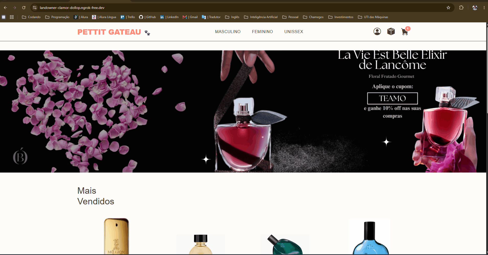
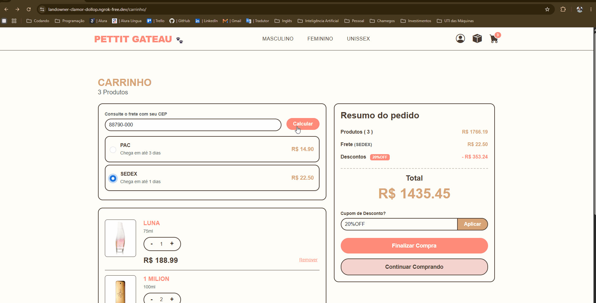
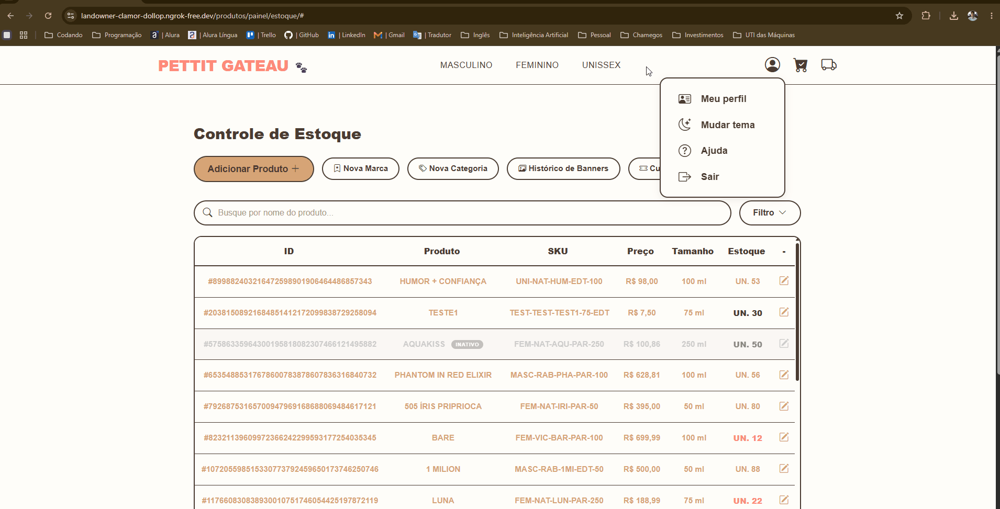
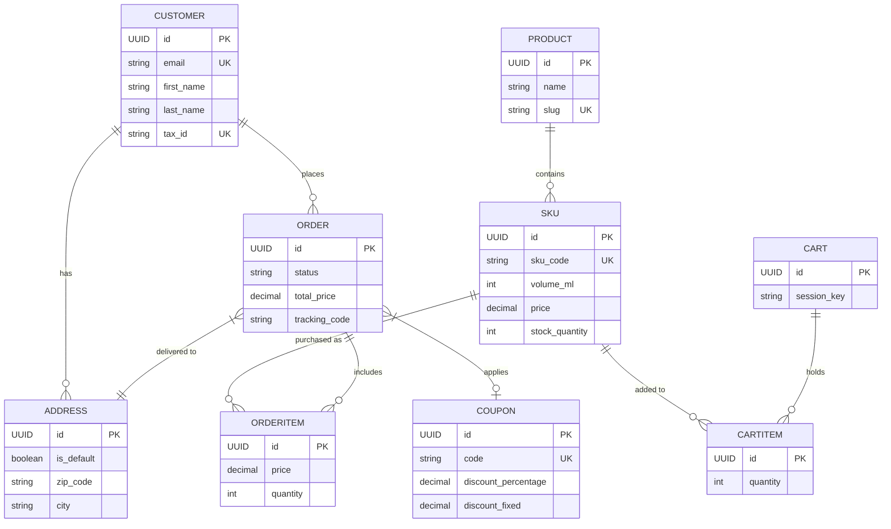

# 🐾 Pettit Gateau | High-Performance E-commerce Backend


**An enterprise-grade niche perfumery e-commerce platform, engineered to demonstrate advanced software architecture patterns, asynchronous payment integrations, and strict data integrity.**

While this project features a fully functional and responsive Vanilla JS frontend, its core purpose is to showcase robust **Back-end Engineering**. It tackles real-world e-commerce challenges such as cart mathematics, external API resilience, and transactional security.

---

## 📸 System Walkthrough

*(Note: Replace the placeholder links below with actual GIFs or screenshots of your project)*

| Storefront & Cart | Checkout & Payment Flow | Customized administration panel and inventory |
| :---: | :---: | :---: |
|  |  |  |
| *Async Cart updates (Fetch API), real-time freight simulation, and coupon validation.* | *Anti-fraud validations and direct Mercado Pago Webhook integration.* | *Custom UI bypassing standard Django Admin for Logistics and Marketing management.* |

---

## 🧠 Core Architecture & Engineering Decisions

Unlike basic CRUD applications, **Pettit Gateau** is built to handle edge cases and maintain business logic integrity:

### 🛡️ Transactional Integrity & Webhooks
* **Asynchronous Inventory Management:** Inventory deductions are triggered *only* via secure webhooks upon Mercado Pago's payment approval. This prevents phantom out-of-stock scenarios caused by abandoned checkouts (e.g., unpaid PIX or Boletos).
* **Float Math Protection:** Discounted orders are dynamically grouped into a single transactional payload before being sent to the payment gateway to completely eliminate API crashes caused by floating-point rounding errors or negative item values.

### 🚚 Resilient Logistics & Anti-Fraud
* **Intelligent Freight Mock & ViaCEP Validation:** Replaced the notoriously unstable public postal API with a resilient local mock service that calculates shipping based on geographic rules (originating from Laguna/SC). Integrated the **ViaCEP API** to instantly validate zip codes and block dummy inputs (e.g., `00000000`).
* **Address Spoofing Prevention:** The checkout view actively cross-references the zip code calculated in the cart against the final selected delivery address, hard-blocking the transaction if discrepancies are found.

### 🏗️ Advanced Data Modeling
* **Abstract Data Governance:** All entities inherit from a universal `BaseModel` providing automated UUIDs (preventing enumeration attacks), audit timestamps (`created_at`/`updated_at`), and `is_active` flags for safe soft-deletions.
* **Decoupled SKU Architecture:** Logical separation between Product (Identity) and SKU (Logistics/Pricing), allowing independent inventory tracking across different volumes with historical price snapshotting on `OrderItems`.

---

## 🗺️ Entity-Relationship Diagram (ERD)

The database schema is heavily normalized, built on PostgreSQL, and designed for scalability.



## ⚙️ Prerequisites
To run this project locally, ensure you have the following installed:

* Docker and Docker Compose
* Python 3.11+
* Git
* Ngrok (For testing local webhooks)

## 🚀 Installation & Setup
**1. Clone the repository:**
```bash
git clone [https://github.com/BrendonCordova/pettit-gateau.git](https://github.com/BrendonCordova/pettit-gateau.git)
cd pettit-gateau
```

**2. Configure Environment Variables:**
Create a `.env` file in the root directory based on `.env.example`:
```env
SECRET_KEY=your_django_secret_key
DEBUG=True
POSTGRES_PASSWORD=your_database_password
MP_ACCESS_TOKEN=your_mercado_pago_token
WEBHOOK_BASE_URL=[https://your-ngrok-url.ngrok-free.app](https://your-ngrok-url.ngrok-free.app)
EMAIL_HOST_USER=your_smtp_email
EMAIL_HOST_PASSWORD=your_app_password
```

**3. Boot the Database (Docker):**
```bash
docker-compose up -d db
```

**4. Set up the Virtual Environment & Dependencies:**
```bash
python -m venv .venv
source .venv/bin/activate  # On Windows: .venv\Scripts\activate
pip install -r requirements.txt
```

**5. Apply Migrations & Create Superuser:**
```bash
python manage.py migrate
python manage.py createsuperuser
```

**6. Start the Local Server:**
```bash
python manage.py runserver
```

> **Note on Webhooks:** To fully test the Mercado Pago checkout flow locally, start an Ngrok tunnel (`ngrok http 8000`), copy the HTTPS URL, update the `WEBHOOK_BASE_URL` in your `.env` file, and restart the Django server.

## 🧪 Testing
The application includes comprehensive test suites focusing on core logic, user permissions, API endpoints, and webhook mocking.
```bash
python manage.py test
```

## 🔄 Git Workflow
This project utilizes the **GitHub Flow** methodology:
* `main` branch acts as the production-ready source of truth.
* Features and bug fixes are developed on ephemeral branches (`feat/*`, `fix/*`, `docs/*`).
* Strict enforcement of atomic commits and Pull Requests for continuous integration.

---
*Architected and developed by **Brendon Gomes de Cordova** as a demonstration of production-ready Backend Engineering.*