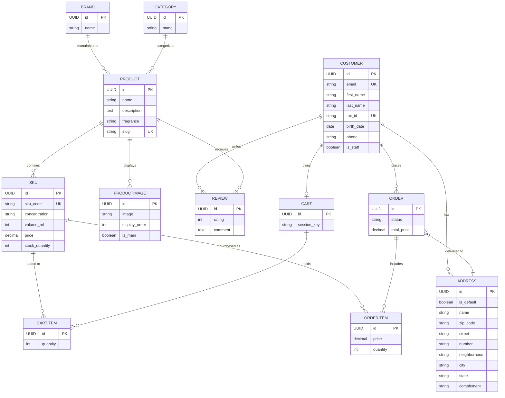

# 🐾 Pettit Gateau | High-Performance E-commerce Backend


**An enterprise-grade niche perfumery e-commerce backend focused on high scalability, asynchronous payment integrations, and strict data integrity.**

This project serves as a comprehensive online sales ecosystem, engineered to demonstrate advanced software architecture patterns, internationalized data modeling, and modern backend security protocols.

---

## 🧠 Core Architecture & Technical Highlights

Unlike basic CRUD applications, **Pettit Gateau** addresses real-world business challenges through robust backend engineering:

* **Hybrid Rendering Architecture:** Strategic separation of concerns. Utilizes **SSR (Django Templates)** for public-facing storefronts (PLP/PDP) to maximize SEO and Time-to-First-Byte, combined with **API-Driven (DRF)** endpoints for transactional flows (Cart/Checkout) ensuring high responsiveness.
* **Transactional Integrity & Webhooks:** Complete integration with **Mercado Pago SDK**. Inventory deductions are strictly asynchronous—triggered *only* via secure webhooks upon payment approval to prevent phantom out-of-stock scenarios from abandoned checkouts (PIX/Boleto).
* **Cryptographic Security First:** Custom Email-Auth user model replacing standard usernames. Features a highly secure, token-based account activation flow (Base64 + Django Token Generator) to mitigate spam and bot registrations.
* **Abstract Data Governance:** All entities inherit from a universal `BaseModel` providing automated UUIDs (preventing enumeration attacks), audit timestamps (`created_at`/`updated_at`), and `is_active` flags for safe soft-deletions.
* **Advanced SKU Modeling:** Logical decoupling between Product (Identity) and SKU (Logistics/Pricing), allowing for independent inventory tracking across different volumes (e.g., 50ml vs. 100ml) with historical price snapshotting on orders.
* **Codebase Standardization:** Fully documented using **Google Style Docstrings** across all modules (Views, Models, APIs, Tests), adhering to top-tier software engineering standards.

## 🗺️ Entity-Relationship Diagram (ERD)

The database schema is heavily normalized, built on PostgreSQL, and designed for scalability. All tables inherit from a `BaseModel` featuring UUID primary keys, soft-deletion flags, and audit timestamps.



## 🖥️ User Interface & Frontend Integration (Coming Soon)
*This section is reserved for the upcoming frontend implementation phase. It will feature UI screenshots, responsive design details, and documentation on how the Vanilla JS frontend consumes the DRF endpoints.*

## ⚙️ Prerequisites
To run this project locally, ensure you have the following installed:

* Docker and Docker Compose
* Python 3.11+
* Git
* Ngrok (For testing local webhooks)

## 🚀 Installation & Setup
**1. Clone the repository:**
```bash
git clone [https://github.com/BrendonCordova/pettit-gateau.git](https://github.com/BrendonCordova/pettit-gateau.git)
cd pettit-gateau
```

**2. Configure Environment Variables:**
Create a `.env` file in the root directory based on `.env.example`:
```env
SECRET_KEY=your_django_secret_key
DEBUG=True
POSTGRES_PASSWORD=your_database_password
MP_ACCESS_TOKEN=your_mercado_pago_token
WEBHOOK_BASE_URL=[https://your-ngrok-url.ngrok-free.app](https://your-ngrok-url.ngrok-free.app)
EMAIL_HOST_USER=your_smtp_email
EMAIL_HOST_PASSWORD=your_app_password
```

**3. Boot the Database (Docker):**
```bash
docker-compose up -d db
```

**4. Set up the Virtual Environment & Dependencies:**
```bash
python -m venv .venv
source .venv/bin/activate  # On Windows: .venv\Scripts\activate
pip install -r requirements.txt
```

**5. Apply Migrations & Create Superuser:**
```bash
python manage.py migrate
python manage.py createsuperuser
```

**6. Start the Local Server:**
```bash
python manage.py runserver
```

> **Note on Webhooks:** To fully test the Mercado Pago checkout flow locally, start an Ngrok tunnel (`ngrok http 8000`), copy the HTTPS URL, update the `WEBHOOK_BASE_URL` in your `.env` file, and restart the Django server.

## 🧪 Testing
The application includes comprehensive test suites focusing on core logic, user permissions, API endpoints, and webhook mocking.
```bash
python manage.py test
```

## 🔄 Git Workflow
This project utilizes the **GitHub Flow** methodology:
* `main` branch acts as the production-ready source of truth.
* Features and bug fixes are developed on ephemeral branches (`feat/*`, `fix/*`, `docs/*`).
* Strict enforcement of atomic commits and Pull Requests for continuous integration.

---
*Architected and developed by **Brendon Gomes de Cordova** as a demonstration of production-ready Backend Engineering.*